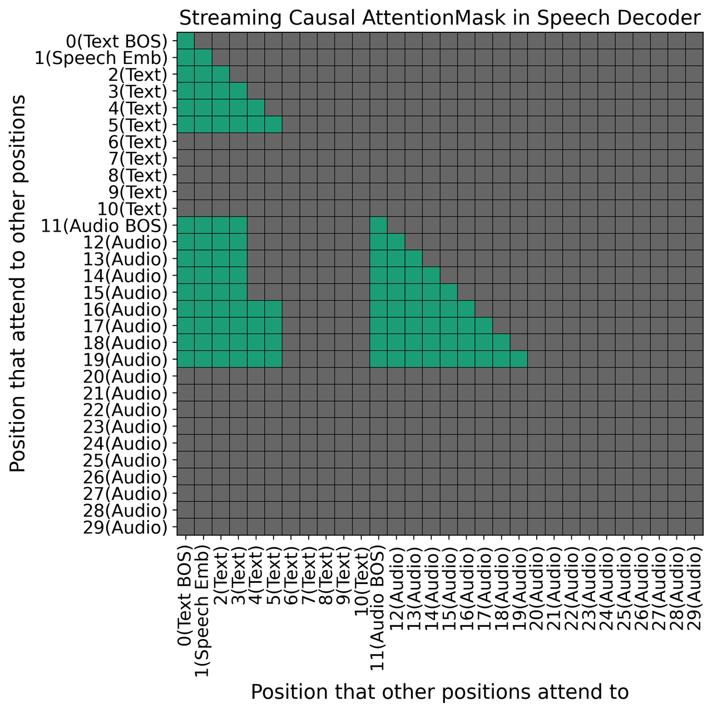

# MiniCPM-o 2.6原理解析
虽然本项目主要探索文本/音频转换模型技术，MiniCPM-o 2.6模型处理支持文本和视觉模态外，也能支持音频输入输出，并且其支持全双工交流和对话打断，功能极其强劲，属于GPT-4o级别的模型，值得深入研究。以下内容是对OpenBMB公布的[技术报告](https://openbmb.notion.site/MiniCPM-o-2-6-A-GPT-4o-Level-MLLM-for-Vision-Speech-and-Multimodal-Live-Streaming-on-Your-Phone-185ede1b7a558042b5d5e45e6b237da9)的提炼，对更多细节感兴趣的可以阅读原文。

 - [介绍](#介绍)
 - [架构](#架构)
 - [多模态在线流机制](#多模态在线流机制)
 - [多模态系统提示词](#多模态系统提示词)
 - [模型训练](#模型训练)
 - [限制](#限制)

## 介绍
&emsp;&emsp;MiniCPM-o 2.6是OpenBMB在MiniCPM-v系列模型基础上开发的多模态大语言模型/MLLM，能接收图片、视频、文本和音频输入，并以端到端的方式输出高质量文本和音频。虽然总参数量只有8B，但MiniCPM-o 2.6在多视觉、语音和多模态流式输出方面能力与GPT-4o-202405相当。具体来说，MiniCPM-o 2.6的显著特点包括：
 - 领先的视觉能力：单图、多图和视频理解能力都很强，并且有良好的上下文学习能力
 - SOTA的语音能力：支持中/英文的双语实时语音对话，具有强劲的音频理解理解能力，还支持情感、语速、风格控制，端到端声音克隆，角色扮演等
 - 强大的多模态流式能力：能接收独立于用户queries的连续视频和音频流输出，支持实时语音交互
 - 强大OCR及其他能力：能处理任意尺寸比的图片，最高支持180万像素；在OCRBench中获得25B参数量以下模型的SOTA效果；基于RLAI-V和VisCPM技术，在MMHal-Bench上表现优于GPT-4o和Claude 3.5 Sonnet，并支持30多种语言的视觉语言功能
 - 卓越的性能：具有强劲的token密度(多少个像素可以编码为一个视觉token)，可将一张180万像素图片处理为640个视觉tokens，比大多数模型少75%，直接提高推速度，首token延迟和所需内存等

&emsp;&emsp;人类可持续从环境中感知视觉、音频和文本流信息，低延迟的产生语音和文本输出，这对MLLM来说是据答的挑战，MiniCPM-o 2.6是如何实现多模态实时交互的呢？
  1. 将原来的多模态信息离线编解码转换为在线的流式编解码：大多数模态编码器和解码器都是离线的，意味着LLM backbones必须等待所有的视频/音频输入全部编码结束后才能进行推理，并且还需要等待所有的tokens预测结束后才能进行后续解码操作。MiniCPM-o 2.6在时间维度上将不同模态的流式输入/输出划分为小的chunks，实现以chunk的方式进行编码/解码来降低延迟。与CosyVoice2中提出的[Chunk-aware Flow Matching](CosyVoice.md#chunk-aware-flow-matching)类似，允许解码器在第一段文本chunk预测结束后就能立即生成音频
  2. 提出一种全模态时分复用机制处理并行多模态流：借鉴通信领域中时分复用技术，按1s一个chunk将每个模态的流进行切分，将同一时刻的内所有模态信息打包，使得LLM backbone可以实时高效处理多模态信息

&emsp;&emsp;大量传统语音对话模型基于ASR-LLM-TTS管道构建，因为ASR导致失去大量的信息，如用户的情感、环境音等。端到端的模型可以直接处理音频流，但面临较低的数据和计算效率问题。MiniCPM-o 2.6如何实现语音对话中高效的端到端语音、情绪、语调控制？
 1. 采用轻量级的语音解码器，通过密集的隐藏表示和文本标记以混合方式与LLM连接。LLM 生成的隐向量确保了语音监督可以以端到端的方式反向传播到整个模型参数，从而实现更高的潜力。文本连接提供了强大的语义控制，并减少了对训练数据的需求。为了学习丰富且细粒度的语音知识，在大规模自然语音数据上进行预训练，然后将模型与用户指令对齐。

## 架构
&emsp;&emsp;MiniCPM-o 2.6基于SigLip-400M、Whisper-medium-300M、ChatTTS-200M和Qwen2.5-7B-Instruct模型构建，完整架构如下图所示：

*图1: MiniCPM-o 2.6模型整体架构*

### 端到端的语音建模
&emsp;&emsp;端到端的混合语音建模架构具有高的性能潜力，在训练和推理方面具有良好的数据和计算效率。为便于高效理解，将输入音频传入Whisper encoder压缩为token表征；默认情况下，Whisper encoder将1s音频压缩为50个tokens。受LLaVA-UHD启发，为了实现更好的token密度和计算效率，在将音频tokens传入LLM backbone之前对齐进一步压缩。实现结果表明，将编码率从50 tokens/s压缩到25 tokens/s，可以忽略信息损失。

&emsp;&emsp;为了实现对语音输出的细粒度控制，LLM backbone先预测出speech embedding，然后预测对应的text tokens；预测的speech embedding和text tokens作为生成最终mel谱图的条件。MiniCPM-o 2.6使用一个基于ChatTTS初始化的轻量级自回归音频解码器，能对speech embedding、text tokens和audio tokens进行联合建模。

&emsp;&emsp;MiniCPM-o 2.6使用音频的编码表征连接音频编码器和LLM backbone，即不会执行ASR，不会大幅度丢失信息。LLM backbone和音频解码器以混合方式连接：
 1. LLM backbone输出的密集speech embedding控制语音、情绪、口音和其他细粒度特征。训练过程中，speech decoder的梯度会向后传递到所有模型参数，包括LLM backbone、音频/视频编码器。注意，整个模型以端到端的方式训练，没有任何中间损失或监督信息。
 2. 也会将LLM backbone预测的text tokens传入到speech decoder，以获取更好的语义控制和训练数据效率。

### 端到端的视觉理解
&emsp;&emsp;MiniCPM-o 2.6遵循了LLaVA-UHD中的自适应视觉编码方法以获取高分辨率视觉理解。模型能处理任意尺寸比的图片，且最高支持180万像素。首先，将图片分成数个小slices，每个slice在分辨率和横纵比上可更好匹配ViT的预训练设置；为了保证计算效率，每张图片至多划分为9个slices。其次，将单个slice和原始图片送入SigLip获取视觉特征。最后，影月感知重采样层将每个大小可变的slice压缩为64个视觉tokens，具体如下图所示。

*图2: 视觉tokens生成过程*

## 多模态在线流机制
&emsp;&emsp;MiniCPM-o 2.6中的多模态在线流机制包括1）将语音编解码器转换为在线流式；2）是LLM backbone可以并处处理多模态流信息。

&emsp;&emsp;大多数现存的模型仅能在整个音频输入信号完全结束后才能进行编码，因此引入了极大的延迟。为了解决此问题，将音频划分为chunks，一个chunk是1s音频对应的固定数量的audio tokens。在音频编码时，每个chunk基于因果注意力范式，只与其自身和之前的chunks进行注意力计算，以满足在线流式编码要求，同时与离线整体编码相比，保持最小的信息损失。

&emsp;&emsp;大多数音频生成模型需要所有的text tokens预测结束后才能生成音频，如下图A所示；此种方式对离线任务友好，但在在线流式场景下并不能令人满意。相反，流式的text2speech模型在部分text tokens预测后即可开始生成并播放音频，更适合在线流式场景。

&emsp;&emsp;为实现流式音频生成，每次预填固定数量的text tokens(chunk size为n)，然后编码器会立刻基于其解码出固定数量的audio tokens(chunk size为m)。在解码时，编码器会基于当前的text tokens和之前chunk的audio tokens进行解码，以实现流式音频生成。然后对下一个chunk中的text tokens和audio tokens重复此操作，依此类推。为了实现以上流式策略，并在目前SOTA的音频解码模型基础上保持最小改动，引入了两个主要改变：
 1. Allocate the first N positions for text：使用语音解码器上下文中的前**N**个位置来保存语音嵌入和部分可用的文本tokens
 2. Introduce a streaming causal attention mask：每个新生成的音频chunk只能看到其之前几个文本tokens和所有音频音频tokens

&emsp;&emsp;下图A-E展示了文本tokens和音频tokens生成过程中注意力掩码的逐步编码过程。通过控制文本和音频tokens之间的基于chunk的注意力掩码，能够以实时的方式生成部分音频。

 1. 在图B中，以LLM backbone生成的speech embeddings和预测出的前**n**(如2)个tokens开始，具体预填组成如图B所示；模型基于预填内容可预测出**m**(如4)个音频tokens，预测出的新token只关注预填的n+2个预填位置和其自身之前预测出的音频tokens。
 2. 重复步骤1，LLM先预测出n个text tokens，将其预填入音频解码器， 然后再预测对应的m个音频tokens；此过程会关注所有的预测出的text tokens，而不只是新预测出的text tokens，如图C所示。
 3. 随着推理进行，LLM backbone完成所有的text tokens预测，最终剩下的k(k <= n>)个text tokens预填入音频解码器，预测出对应的音频tokens，如图D所示。
 4. 在没有新的text tokens预测出来的情况下继续预测音频tokens，直到预测出 \<Audio EOS\> 这个特殊token，结束整个预测过程，如图E所示。

| 图A| 图B| 图C|
|:---:|:---:|:---:|
| 图D| 图E||

&emsp;&emsp;上述提高的**N**、**n**、**m**是超参数，MiniCPM-o 2.6实际使用时设置**N**=300，**n**=10，**m**=50，在性能和推理速度之间取一个平衡。

&emsp;&emsp;在处理视频流数据时，将视频流表示为采样率为1 fps的帧序列，即每秒从输入的视频流采样一帧，使用自定义高分辨率编码策略进行编码，编码后的特征向量被送入LLM backbone。为了在效率和性能之间取得平衡，设用了一种混合分辨率编码策略；具体是，仅对用户查询结束时的最后一帧进行高分辨率编码，其他帧使用中等分辨率编码。

&emsp;&emsp;使用多模态时分复用机制对各模态进行时间对齐。沿着共享时间线将各模态信息同步，如图1所示；将每个模态的流分成chunks(1s为一个chunk)，将同一秒内的所有模态信息分组为一个序列单元；然后将多个包含多模态信息的序列单元按时间顺序组合，送入LLM backbone处理。
&emsp;&emsp;注意，MiniCPM-o 2.6即使在用户没有进行查询时也会一直感知多模态输入；如图1中显示的，不是所有时间段都有Query输入，而所有时间段都有视频流和音频流输入。与大多数已有的多模态模型只在用户查询期间采样少数帧的方式不同，这种方式使得MiniCPM-o 2.6可以解决需要时间记忆和推理的任务，并且原生支持多轮在线对话。

## 多模态系统提示词
&emsp;&emsp;良好的系统提示词可以定义模型的动作，提高准确性，改善语气等，然而生成语音响应的端到端多模态模型面临额外挑战。模型输出的听觉特征(例如声音、音调、口音和其他细微特征)至关重要，但不能仅通过文本来传达。为了处理此问题，引入了多模态系统提示词概念，允许以声学方式控制声音属性，确保输出语音与用户意图一致。

&emsp;&emsp;多模态系统提示词包含传统的文本系统提示词和用于确定生成声音的音频系统提示词(实际应用如下图所示)，使得推理时可以灵活配置语音，可通过一段语音示例作为音频系统提示词类指定端到端的声音克隆。此外，还可以将音频系统提示词保持为空，通文本提示词引导模型生成新的声音。

## 模型训练
&emsp;&emsp;MiniCPM-o 2.6采用多阶段训练使模型逐渐学习新的模态知识，避免模型冲突，将各种模态能力集中到一个模型中，训练过程包括预训练，有监督微调和RLAIF三个阶段。

&emsp;&emsp;预训练中，首先分别在单个模态上进行视觉和音频预训练，然后在多模态上进行预训练，将多模态深度结合。
- 视觉预训练：先使用大体量的图片-文本对数据集对齐视觉和语言模块，此过程中LLM backbone冻结，只更新视觉编码模块，使模型具有基本的图像理解和OCR能力。然后基于图像-文本交错数据训练，同时更新视觉编码器和LLM backbone，使模型具有多图理解和多模态上下文学习能力。
- 音频预训练：使用音频-文本对数据训练音频映射层来进行音频模态对齐。为了学习丰富、细粒度的语言知识，对自然语音数据进行大规模端到端预训练，然后将模型与用户指令对齐。
- 多模态预训练：使用时分复用机制结合来自大规模网络视频的视觉和音频流，使模型能够从不同模态获取或整合丰富的多模态知识。

&emsp;&emsp;多模态SFT阶段，使用高质量多模态数据进行监督微调，包括视觉问答、语音理解、语音生成和带音频的视频理解等数据；对模型进行充分微调，同一模型的视觉能力、语音理解和生成能力、在线流处理能力，同时增强模型的指令跟随能力。

&emsp;&emsp;最后，MiniCPM-o 2.6采用[RLAIF-V](https://github.com/RLHF-V/RLAIF-V)技术基于AI反馈进一步提高模型可行度。在此阶段，模型使用分而治之的策略对不同的采样结果进行评分，构建DPO偏好数据集，基于其进行模型优化，极大降低了视频幻觉的出现，还使用MMPR等开源偏好数据集增强训练数据。

## 限制
 1. 潜在的不稳定语音输出：多模态系统提示让语音控制变得更加灵活，实现了很多好玩的功能，但也对语音输出的稳定性提出了更多的挑战。与传统的语音转语音模型（记住单个语音的完整参数）相比，MiniCPM-o 2.6 需要从多模态系统提示中提取和克隆语音。因此，语音生成有时会出现背景嘈杂和声音无意义的缺陷
 2. 长音频生成：目前原生不能支持生成超过45s的语音，但使用了滑动窗口的方法来生成更长的语音；然而，训练和滑动窗口推理之间的差距可能导致长语音生成过程中出现失败的清情况
 3. 优先的多模态在线流能力：在感知、理解和推理能力上还存在一定局限性